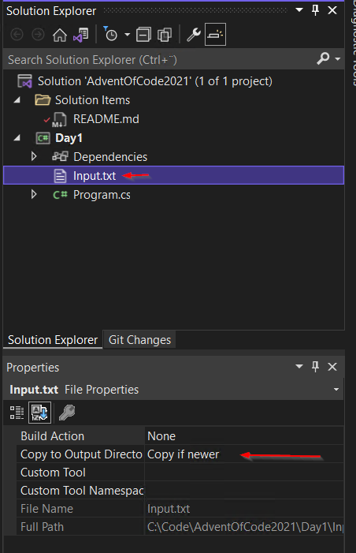

# Advent Of Code 2021

My solutions in C# to [Advent Of Code](https://adventofcode.com/) challenges.
I use Visual Studio 2022 and .NET 6.

## Day 1 / Part 1

We store the list of depth values in a text file `Input.txt`. 
One value per line.
Remember to set `Copy to Output Directory` to `Copy if newer` 
on the `Input.txt` file.



### Code

```C#
// Read all values from the file
var lines = File.ReadAllLines("Input.txt");

// Don't count the first value, it will be less than int.MaxValue
int oldValue = int.MaxValue;
int counter = 0;

foreach (var line in lines)
{
    // Convert from string to int
    var value = int.Parse(line);

    // If the oldValue is less then the value the depth is increasing
    if (oldValue < value)
    {
        // Depth is increasing
        // Increment the counter by one
        counter++;

        // Debug output
        Console.ForegroundColor = ConsoleColor.Green;
        Console.WriteLine($"{value} (increased) {counter}");
    }
    else
    {
        // Depth is decreasing
        // Debug output
        Console.ForegroundColor = ConsoleColor.Red;
        Console.WriteLine($"{value} (decreased) {counter}");
    }

    // Store the value in the oldValue so that we can compare the next value with the current
    oldValue = value;
}

// Show the result
Console.ForegroundColor = ConsoleColor.Magenta;
Console.WriteLine($"Counter: {counter}");
Console.ResetColor();
```

### Output

```cmd
...
8072 (increased) 1558
8067 (decreased) 1558
8056 (decreased) 1558
8064 (increased) 1559
8075 (increased) 1560
8078 (increased) 1561
8081 (increased) 1562
8112 (increased) 1563
8127 (increased) 1564
Counter: 1564
```

### Summary

We start with a really big number `int.MaxValue` as the 
initial value of the variable `oldValue` because the 
first `value` in our list of values can't be `increased`.

We loop through all values and compare the `oldValue` with 
the current `value` and if the `oldValue` is less then 
the current `value` the depth increases and we increment 
the `counter` by one.

Last we print the `counter` to the Console.

## Day 1 / Part 2

In Part 2 we will use a sliding window of three values
to see how the depth changes.

### Code

```C#
// Read all values from the file and stor them in a string array
var lines = File.ReadAllLines("Input.txt");

// Don't count the first value, it will be less than int.MaxValue
int oldValue = int.MaxValue;
int counter = 0;

// We change the loop from a foreach to a for-loop because we only
// want to loop untill we don't have enough numbers left to calculate
// the sum and we also incresse the startIndex on each irritation.
for (int startIndex = 0; startIndex < lines.Length - 2; startIndex++)
{
    // Calculate the stopIndex. 
    // We have a sliding window of three values
    var stopIndex = startIndex + 3;

    // Take the three values in the sliding window.
    // Convert from string to int, add the numbers and store the sum.
    var value = lines[startIndex..stopIndex].Sum(v => int.Parse(v));

    // If the oldValue is less then the value the depth is increasing
    if (oldValue < value)
    {
        // Depth is increasing
        // Increment the counter by one
        counter++;

        // Debug output
        Console.ForegroundColor = ConsoleColor.Green;
        Console.WriteLine($"{value} (increased) {counter}");
    }
    else if(oldValue == value)
    {
        // Depth is not changing
        // Debug output
        Console.ForegroundColor = ConsoleColor.Yellow;
        Console.WriteLine($"{value} (no change) {counter}");
    }
    else
    {
        // Depth is decreasing
        // Debug output
        Console.ForegroundColor = ConsoleColor.Red;
        Console.WriteLine($"{value} (decreased) {counter}");
    }

    // Store the value in the oldValue so that we can compare the next value with the current
    oldValue = value;
}

// Show the result
Console.ForegroundColor = ConsoleColor.Magenta;
Console.WriteLine($"Counter: {counter}");
Console.ResetColor();
```

### Output
```cmd
...
24141 (increased) 1602
24141 (no change) 1602
24141 (no change) 1602
24144 (increased) 1603
24167 (increased) 1604
24191 (increased) 1605
24210 (increased) 1606
24209 (decreased) 1606
24195 (decreased) 1606
24187 (decreased) 1606
24195 (increased) 1607
24217 (increased) 1608
24234 (increased) 1609
24271 (increased) 1610
24320 (increased) 1611
Counter: 1611
```

### Summary

We change the loop from a `foreach` to a `for` loop 
to get the `startIndex` of the sliding window.

To get three values insted of one when we compare we are using 
`lines[startIndex..stopIndex]` syntax to create a new collection
with just the three values in our sliding window.

To sum the three values we need to convert from `string` to `int` 
as before with `int.Parse()` and we use the method `IEnumerable<T>.Sum()` 
to add the three numbers in the collection before we compare with 
the `oldValue` as in we do in Part 1.

## Day 2 / Part 1

In this callange we get a list of commands for the submarine, 
each command contains a direction and an amout to move.

### Code

Let's create a `Submarine` class that holds the state and a 
`Movement` class to change the state of the `Submarine`.

#### Movement

Let's create a `Movement` class that handles a line of the input.
The parameter `instruction` of the constructor is a string `forward 6`. 
The string represents two commands to the submarine, the `Direction` to move and how much to move `Units`.

```C#
public class Movement
{
    public Movement(string instruction)
    {
        // Split the string on a space char
        var i = instruction.Split(' ');

        // The first part of the string is the Direction.
        Direction = i[0];

        // The second part of the string is
        // the value the Submarine are going to move
        Units = Convert.ToInt32(i[1]);
    }

    // The direction the Submarine is going to move in
    public string Direction { get; set; }

    // The value of the movement
    public int Units { get; set; }
}
```

#### Submarine

The `Submarine` class needs to keep track of two
different values `HorizontalPosition` and `Depth`.
It also needs to handle a `Movement` request.

```C#
public class Submarine
{
    // The current horizontal position of the Submarine
    public int HorizontalPosition { get; private set; } = 0;

    // The current depth of the Submarine
    public int Depth { get; private set; } = 0;

    // The only way to move the Submarine in any direction
    public void Move(Movement movment)
    {
        // What Direction is the Submarine moving?
        switch (movment.Direction)
        {
            // Move forward
            case "forward":
                Forward(movment.Units);
                break;

            // Move up
            case "up":
                Up(movment.Units);
                break;

            // Move down
            case "down":
                Down(movment.Units);
                break;
        }

        // Debug output
        Console.WriteLine($"Move: {movment.Direction}, Units: {movment.Units}, HorizontalPosition: {HorizontalPosition}, Depth: {Depth}");
    }

    private void Forward(int units)
    {
        // Increase the HorizontalPosition by the Units of the Movement
        HorizontalPosition += units;
    }

    private void Up(int units)
    {
        // Decrease the Depth of the Submarine by the Units of the Movement
        Depth -= units;
    }

    private void Down(int units)
    {
        // Increase the Depth of the Submarine by the Units of the Movement
        Depth += units;
    }
}
```

#### Program

Loop through all the lines in the `Input.txt` file, create a `Movement` object 
and send it to the `Submarine.Move` method.

```C#
// Read all Movements from the file and store them in a string array
var lines = File.ReadAllLines("Input.txt");

// Create the Submarine object
Submarine submarine = new Submarine();

// Loop through all the instructions on how to move the Submarine
foreach (var line in lines)
{
    // Create the current Movement
    var movement = new Movement(line);

    // Move the Submarine
    submarine.Move(movement);
}

// Show the result
Console.ForegroundColor = ConsoleColor.Magenta;
Console.WriteLine($"Horizontal Position: {submarine.HorizontalPosition} * Depth: {submarine.Depth} = {submarine.HorizontalPosition * submarine.Depth}");
Console.ResetColor();
```

### Output

```cmd
...
Move: up, Units: 2, HorizontalPosition: 2033, Depth: 802
Move: forward, Units: 9, HorizontalPosition: 2042, Depth: 802
Move: down, Units: 8, HorizontalPosition: 2042, Depth: 810
Move: forward, Units: 2, HorizontalPosition: 2044, Depth: 810
Move: down, Units: 6, HorizontalPosition: 2044, Depth: 816
Move: down, Units: 1, HorizontalPosition: 2044, Depth: 817
Move: down, Units: 9, HorizontalPosition: 2044, Depth: 826
Move: forward, Units: 6, HorizontalPosition: 2050, Depth: 826
Horizontal Position: 2050 * Depth: 826 = 1693300
```

### Summary

By creating a `Movement` class containing the `Direction` and `Units` properties
we made it easy to loop over the lines in the `Input.txt` file and
send each movement to the `Submarine`.
The `Submarine` class holds its state in the `HorizontalPosition` and the `Depth`
properties. The `Move` method mutates the state of the `Submarine` object.

## Day 2 / Part 2

The `Submarine` should only changes the values of the `HorizontalPosition` and the `Depth`
properties when it moves forward. When the `Submarine` moves `Up` or `Down`
we change the new property `Aim` on the `Submarine` object.

### Code

```C#
// Read all Movements from the file and store them in a string array
var lines = File.ReadAllLines("Input.txt");

// Create the Submarine object
Submarine submarine = new Submarine();

// Loop through all the instructions on how to move the Submarine
foreach (var line in lines)
{
    // Create the current Movement
    var movement = new Movement(line);
    
    // Move the Submarine
    submarine.Move(movement);
}

// Show the result
Console.ForegroundColor = ConsoleColor.Magenta;
Console.WriteLine($"Horizontal Position: {submarine.HorizontalPosition} * Depth: {submarine.Depth} = {submarine.HorizontalPosition * submarine.Depth}");
Console.ResetColor();

public class Movement
{
    public Movement(string instruction)
    {
        // Split the string on a space char
        var i = instruction.Split(' ');

        // The first part of the string is the Direction.
        Direction = i[0];

        // The second part of the string is
        // the value the Submarine are going to move
        Units = Convert.ToInt32(i[1]);
    }

    // The direction the Submarine is going to move in
    public string Direction { get; set; }

    // The value of the movement
    public int Units { get; set; }
}

public class Submarine
{
    // The current horizontal position of the Submarine
    public int HorizontalPosition { get; set; } = 0;

    // The current depth of the Submarine
    public int Depth { get; set; } = 0;

    // The current aim of the Submarine
    public int Aim { get; set; } = 0;

    // The only way to move the Submarine in any direction
    public void Move(Movement movment)
    {
        // What Direction is the Submarine moving?
        switch (movment.Direction)
        {
            // Move forward
            case "forward":
                Forward(movment.Units);
                break;

            // Move up
            case "up":
                Up(movment.Units);
                break;

            // Move down
            case "down":
                Down(movment.Units);
                break;
        }

        // Debug output
        Console.WriteLine($"Move: {movment.Direction}, Units: {movment.Units}, Aim: {Aim}, HorizontalPosition: {HorizontalPosition}, Depth: {Depth}");
    }

    // Increase the HorizontalPosition and Depth by the Units of the Movement and the Aim
    private void Forward(int units)
    {
        HorizontalPosition += units;
        Depth = Depth + (Aim * units);
    }

    // Decrease the Aim of the Submarine by the Units of the Movement
    private void Up(int units)
    {
        Aim -= units;
    }

    // Increase the Aim of the Submarine by the Units of the Movement
    private void Down(int units)
    {
        Aim += units;
    }
}

```

### Output

```cmd
...
Move: up, Units: 2, Aim: 802, HorizontalPosition: 2033, Depth: 892527
Move: forward, Units: 9, Aim: 802, HorizontalPosition: 2042, Depth: 899745
Move: down, Units: 8, Aim: 810, HorizontalPosition: 2042, Depth: 899745
Move: forward, Units: 2, Aim: 810, HorizontalPosition: 2044, Depth: 901365
Move: down, Units: 6, Aim: 816, HorizontalPosition: 2044, Depth: 901365
Move: down, Units: 1, Aim: 817, HorizontalPosition: 2044, Depth: 901365
Move: down, Units: 9, Aim: 826, HorizontalPosition: 2044, Depth: 901365
Move: forward, Units: 6, Aim: 826, HorizontalPosition: 2050, Depth: 906321
Horizontal Position: 2050 * Depth: 906321 = 1857958050
```

### Summary

We just added the `Aim` property on the `Sumbarime` class and changed 
the way we calculate the `Depth` property on movement.